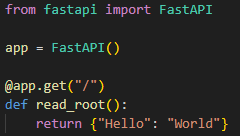
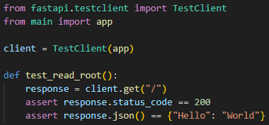
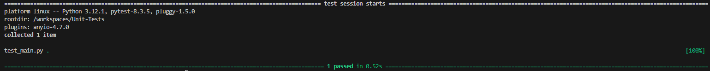
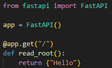
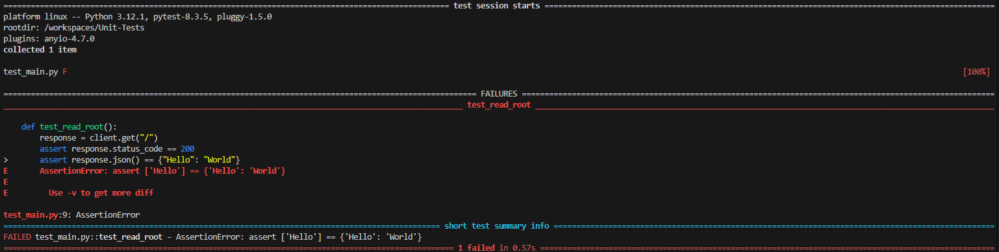

# Unit-Tests
Unit testing practice, going from simple programs to more complex ones.  
This README is a 'journal' which I am using to help me learn about unit testing.  
There are multiple branches for different sections
## FastAPI
### Testing without errors
Currently, `main.py` looks like this:  
  
And `test_main.py` looks like this:  
  
Running `pytest`, the output is:  
  
This means that the test passed (it was able to pass in the expected response at the root endpoint using a GET request).
### Testing with an error
I changed `main.py` to look like this:  
  
`test_main.py` is the same as before.
Running `pytest`, the output is:  
  
This clearly shows that the test failed, specifially on the output message. This makes it very easy to pinpoint the error, which is especially useful for a large and complex application.
## Sources
I decided to look at a basic test for FastAPI and the code is sourced from this website: https://apidog.com/blog/unit-testing-fastapi/